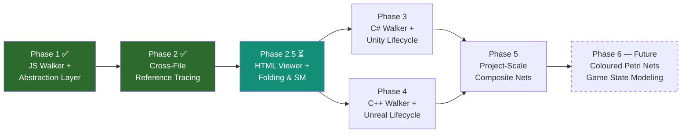
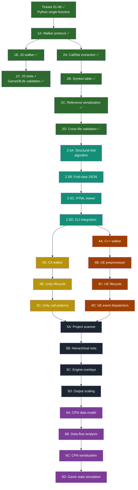

# code2petri — Grand Roadmap to Unity/Unreal Analysis

## Current State (Tickets 01–15 Complete — Phases 1 & 2 Delivered)

We have a fully working, multi-language `code2petri` CLI and Python package that:
- Parses **Python (`.py`)** and **JavaScript (`.js`)** source files, targeting individual functions, methods, callbacks, or global scripts.
- Implements a formal `WalkerProtocol` (`abc.ABC`) returning `WalkResult(net, call_sites)` with `CallSite` inventory records.
- Composes shared graph-building and state-management infrastructure via `ControlFlowBuilder` (counters, try/loop context stacks, `wire_sequential_statement`, `wire_if_split`, `wire_try_catch`, `wire_standard_loop`, `wire_terminal_exception`).
- Decouples AST traversal and statement dispatch via `StatementContext` parameter objects and safe property extractors, eliminating Feature Envy and Message Chains.
- Translates the full spectrum of control-flow structures in both languages: sequential statements, `if/elif/else`, `while`, `for` (including JS `for..in`/`for..of`), `do..while`, `switch/case/default`, `try/catch/finally` (and Python `try/except/else/finally`), `break`, `continue`, `return`, `raise`/`throw`, and function calls.
- Provides cross-language parity for synthetic `(global)` execution scope, allowing top-level script code to be targeted and visualized as standalone Petri nets.
- Supports qualified function targeting for class methods (`ClassName.methodName`) and synthetic addressing for anonymous arrow/callback functions (`(anonymous@line)`).
- Detects `requestAnimationFrame` game-loop recursion patterns and maps them to Petri net back-arcs from terminal execution states to the function start place.
- Performs **Cross-File Reference Tracing (Phase 2)**:
  - Harvests constructor variable bindings (`x = Foo()` / `const x = new Foo()`) per [ADR 0001: Constructor-Only Variable Resolution](file:///Volumes/SharedDrive/Documents/GitHub/code2flow/docs/adr/0001-constructor-only-variable-resolution.md).
  - Indexes context files in a dedicated `SymbolTable`, resolving qualified method calls (`gpuEngine.step()` → `WebGLEngine.step`) and bare function calls while enforcing same-language boundaries.
  - Ingests `--context` file paths or recursive directories with platform-safe filtering (`._*` AppleDouble skip).
  - Serializes call resolutions across formats: PNML `<toolspecific>` XML tags (`<resolved>` / `<unresolved>`), Graphviz DOT (`tooltip` and color coding: `#2e7d32` for resolved, `#e65100` for unresolved), and JSON (`resolved`, `resolved_to`, `target_file`, and root `"status": "[unresolved]"`).
- Outputs PNML (ISO/IEC 15909 compliant XML), Graphviz DOT, JSON, PNG, and SVG.
- Fully verified with **235 passing unit, integration, and cross-file validation tests**, including end-to-end multi-file validation on real-world targets ([GameOfLife_Simulator](file:///Users/pingchungtsai/My%20Drive%20%28ric6121824%40gmail.com%29/Digital%20Media%20MSc/Semester%204/GameOfLife_Simulator): `app.js` and `webgl-engine.js`).
- Concluded Phase 2 code review (Tickets 11–15, Round 6) with **0 Hard Violations**, **0 Missing Requirements**, and **0 Logic Defects**.

## End Goal

Run `code2petri` against an entire **Unity (C#)** or **Unreal Engine (C++)** project and produce:
1. **Per-function Petri nets** for any function in the project
2. **Cross-file composite nets** that trace calls across file boundaries
3. **Engine-aware lifecycle overlays** that model the implicit execution order imposed by the game engine (MonoBehaviour lifecycle, Actor tick/BeginPlay, event dispatchers)
4. **Interactive HTML viewer** with Lassen & van der Aalst structural folding and SM score computation

### Primary Validation Target

**[GameOfLife_Simulator](file:///Users/pingchungtsai/My%20Drive%20%28ric6121824@gmail.com%29/Digital%20Media%20MSc/Semester%204/GameOfLife_Simulator)** — a 2-file JavaScript project:
- [app.js](file:///Users/pingchungtsai/My%20Drive%20%28ric6121824@gmail.com%29/Digital%20Media%20MSc/Semester%204/GameOfLife_Simulator/app.js) (182 lines): global functions (`init`, `loop`, `stepCpu`, `countNeighbors`, etc.) + event listeners
- [webgl-engine.js](file:///Users/pingchungtsai/My%20Drive%20%28ric6121824@gmail.com%29/Digital%20Media%20MSc/Semester%204/GameOfLife_Simulator/webgl-engine.js) (216 lines): `WebGLEngine` class with methods (`step`, `randomize`, `drawToScreen`, etc.)

This project exercises: global-scope code, class methods, cross-file calls (`app.js` → `WebGLEngine`), and the `requestAnimationFrame` game-loop pattern.

---

## Phased Roadmap



---

## Phase 1 — Walker Abstraction & JavaScript Support (Completed — Tickets 07–10, Round 8)

### Why JavaScript first (not C#/C++)

> [!IMPORTANT]
> JavaScript was chosen as the **cheapest proving ground** for multi-language architecture. code2flow already ships an Acorn-based JS parser ([javascript.py](file:///Volumes/SharedDrive/Documents/GitHub/code2flow/code2flow/javascript.py)), so we reused its `get_tree()`. JS has `if/else`, `while`, `for`, `try/catch/finally`, `return`, `switch`, `do..while` — covering and expanding upon the constructs handled in Python.
>
> Additionally, the [GameOfLife_Simulator](file:///Users/pingchungtsai/My%20Drive%20%28ric6121824%40gmail.com%29/Digital%20Media%20MSc/Semester%204/GameOfLife_Simulator) is the primary validation target, so JS support was needed immediately.

### Design Decisions & Implementation Reality

| Decision | Planned Resolution | Final Implementation Reality (Tickets 07–10) |
|---|---|---|
| **Walker Architecture** | Static method protocol | `WalkerProtocol` defined as an `abc.ABC` with instance methods (`parse_file`, `find_function`, `find_all_functions`, `walk_function`, `get_node_lineno`). CLI dynamically routes by extension via `WALKERS[ext]()`. |
| **Composition over Inheritance** | Abstract base class hierarchy | `ControlFlowBuilder` encapsulates Petri net counters, stacks (`loop_stack`, `try_stack`), and wiring primitives (`wire_sequential_statement`, `wire_if_split`, `wire_try_catch`, `wire_standard_loop`, `wire_terminal_exception`). Walkers compose `ControlFlowBuilder` rather than inheriting from a base walker class, preventing subclass coupling and Refused Bequest. |
| **Traversal Decoupling** | Direct AST walking | `StatementContext` parameter object passed across statement dispatch handlers; `get_nested` helper extracts nested AST properties safely, eliminating Feature Envy and Message Chains. |
| **Global-scope code** | Synthetic `(global)` wrapper in JS | Synthetic `(global)` execution scope implemented with parity across **both** `JavascriptWalker` and `PythonWalker`, allowing top-level script statements to be targeted via `--target-function='(global)'`. |
| **Discoverable functions** | Declarations & methods | `FunctionDeclaration`, class methods (qualified as `ClassName.methodName`), named arrow functions / function expressions, and synthetic callback identifiers. |
| **Anonymous callbacks** | Excluded from targeting | Discoverable via `--list-functions` and targetable via parenthetical syntax `ParentFunction.(anonymous@LineNumber)` (e.g., `(anonymous@151)` or `init.(anonymous@42)`). |
| **`requestAnimationFrame(loop)`** | Back-arc cycle | Recursive `requestAnimationFrame` calls where the argument matches the enclosing function name produce back-arcs from terminal execution states to the function start place, faithfully representing game-loop recursion. |
| **Transition Labels** | AST unparsing | Python unparses AST expressions; JavaScript slices raw source text via Acorn byte offsets (`start`/`end`), preserving exact formatting and avoiding AST unparsing fidelity loss. |

### Implemented Tickets (Phase 1 Breakdown)

#### Ticket 07: Walker Protocol & Shared Infrastructure
- Defined [`code2petri/walker_protocol.py`](file:///Volumes/SharedDrive/Documents/GitHub/code2flow/code2petri/walker_protocol.py) with runtime-enforced `WalkerProtocol(abc.ABC)`.
- Created [`code2petri/control_flow_builder.py`](file:///Volumes/SharedDrive/Documents/GitHub/code2flow/code2petri/control_flow_builder.py) containing `ControlFlowBuilder` (counters, loop/try stacks, arc management, higher-level wiring primitives).
- Refactored `PythonWalker` to implement `WalkerProtocol` and compose `ControlFlowBuilder`.
- Updated Python function discovery to output qualified class method names (`ClassName.methodName`).
- Extracted shared graph assertions into [`tests/petri_assertions.py`](file:///Volumes/SharedDrive/Documents/GitHub/code2flow/tests/petri_assertions.py).

#### Ticket 08: JavaScript Walker Skeleton & Sequential Statements
- Implemented [`code2petri/javascript_walker.py`](file:///Volumes/SharedDrive/Documents/GitHub/code2flow/code2petri/javascript_walker.py) consuming Acorn JSON AST from `code2flow.javascript.Javascript.get_tree()`.
- Implemented source text caching and byte-offset slicing for precise transition labels.
- Added top-level statement harvesting and synthetic `(global)` wrapper execution.
- Implemented sequential statement chains, return statement routing to terminal places, and opaque function call transitions.
- Added initial JavaScript unit test suite in [`tests/test_javascript_walker.py`](file:///Volumes/SharedDrive/Documents/GitHub/code2flow/tests/test_javascript_walker.py).

#### Ticket 09: JavaScript Core Control Flow
- Implemented `if / else if / else` branching (XOR-split at condition transition, recursive branch walking, single merge place).
- Implemented `while`, `for`, `for..in`, and `for..of` loops as cycles (loop head place, body transition, back-arc, exit transition).
- Implemented `break` (jump to enclosing loop exit place) and `continue` (jump to loop head place).
- Implemented `try / catch / finally` with exception arcs from try body transitions to catch entry, and convergence into mandatory finally blocks.

#### Ticket 10: JavaScript Specifics & Game-Loop Translation
- Implemented `switch / case / default` as XOR-splits with support for empty case fallthrough.
- Implemented `do...while` loops with body execution preceding condition evaluation.
- Implemented `throw` statements routing to enclosing try block or terminal exception place.
- Implemented qualified class method discovery (`WebGLEngine.step`) and anonymous callback targeting (`(anonymous@line)`).
- Implemented `requestAnimationFrame` game-loop cycle translation (back-arc to function start place).
- Added comprehensive integration tests against actual [`GameOfLife_Simulator`](file:///Users/pingchungtsai/My%20Drive%20%28ric6121824%40gmail.com%29/Digital%20Media%20MSc/Semester%204/GameOfLife_Simulator) source files (`app.js` and `webgl-engine.js`).

### Code Review Round 8 Assessment & Architectural Baseline

The Phase 1 implementation concluded with Code Review Round 8 ([`tickets-07-10-round-8.md`](file:///.scratch/code2petri/reviews/tickets-07-10-round-8.md)) evaluating the entire Phase 1 diff (`f41d6ba`..`325e82d`):

- **Standards Compliance**: **0 Hard Violations**.
  - Strict conformance to repo standards (`CONTEXT.md`): `WalkerProtocol` uses `abc.ABC`, `(global)` naming convention followed uniformly across both walkers, call transitions modeled as opaque nodes.
  - 4 minor smells / maintenance suggestions logged for future refactoring:
    1. *Duplicated Code* ([`python_walker.py:L254-270`](file:///Volumes/SharedDrive/Documents/GitHub/code2flow/code2petri/python_walker.py#L254-L270) vs [`javascript_walker.py:L602-628`](file:///Volumes/SharedDrive/Documents/GitHub/code2flow/code2petri/javascript_walker.py#L602-L628)): Both walkers duplicate the statement iteration loop, `StatementContext` setup, and early-exit logic. *Suggestion: Extract a generic sequence driver onto `ControlFlowBuilder` (e.g. `builder.walk_sequence(statements, start_place, target_exit, dispatch_fn)`).*
    2. *Feature Envy & Data Clump* ([`javascript_walker.py:L425-437`](file:///Volumes/SharedDrive/Documents/GitHub/code2flow/code2petri/javascript_walker.py#L425-L437) & [`python_walker.py:L193-205`](file:///Volumes/SharedDrive/Documents/GitHub/code2flow/code2petri/python_walker.py#L193-L205)): Walkers instantiate places/transitions and pass a `LoopRouting` tuple to `wire_standard_loop()`. *Suggestion: Move `LoopRouting` creation directly inside `wire_standard_loop()`.*
    3. *Divergent Change & Primitive Obsession* ([`javascript_walker.py`](file:///Volumes/SharedDrive/Documents/GitHub/code2flow/code2petri/javascript_walker.py)): `javascript_walker.py` (860+ lines) manages Acorn invocation, node qualification, source slicing, and net wiring on untyped dicts. *Suggestion: Extract into `javascript_ast.py` with typed node wrappers when adding future JS features.*
    4. *Middle Man* ([`python_walker.py:L146-165`](file:///Volumes/SharedDrive/Documents/GitHub/code2flow/code2petri/python_walker.py#L146-L165) & [`javascript_walker.py:L345-391`](file:///Volumes/SharedDrive/Documents/GitHub/code2flow/code2petri/javascript_walker.py#L345-L391)): Simple forwarding methods (`_walk_return`, `_walk_break`, etc.) delegate directly to `builder.wire_*`. *Suggestion: Retained for statement dispatch table uniformity (`self._statement_handlers`).*
- **Spec Verification**: **0 Missing Requirements**, **0 Logic Defects**.
  - All requirements across Tickets 07–10 and `specs/phase-1-js-walker.md` are satisfied.
  - 1 benign scope improvement noted and approved: Python walker `(global)` parity.
  - Entire test suite passing (**166 unit and integration tests**).

### Deliverables Summary

- [`code2petri/walker_protocol.py`](file:///Volumes/SharedDrive/Documents/GitHub/code2flow/code2petri/walker_protocol.py) — Runtime-checked `WalkerProtocol(abc.ABC)`
- [`code2petri/control_flow_builder.py`](file:///Volumes/SharedDrive/Documents/GitHub/code2flow/code2petri/control_flow_builder.py) — `ControlFlowBuilder` composition layer
- [`code2petri/javascript_walker.py`](file:///Volumes/SharedDrive/Documents/GitHub/code2flow/code2petri/javascript_walker.py) — Full JavaScript AST walker
- [`code2petri/python_walker.py`](file:///Volumes/SharedDrive/Documents/GitHub/code2flow/code2petri/python_walker.py) — Refactored Python walker
- [`code2petri/engine.py`](file:///Volumes/SharedDrive/Documents/GitHub/code2flow/code2petri/engine.py) — Multi-language CLI and engine routing
- [`tests/petri_assertions.py`](file:///Volumes/SharedDrive/Documents/GitHub/code2flow/tests/petri_assertions.py) — Shared Petri net assertions
- Test suite: 166 passing tests across `tests/test_walker_protocol.py`, `tests/test_python_walker.py`, `tests/test_javascript_walker.py`, `tests/test_petri_pipeline.py`, etc.

---

## Phase 2 — Cross-File Reference Tracing (Completed — Tickets 11–15, Round 6)

### Why this comes before C#/C++

> [!IMPORTANT]
> Both Unity and Unreal projects are **multi-file, multi-class** codebases. Without cross-file tracing, we can only analyze one function in isolation — useless for a 200-file Unity project. This capability is language-agnostic infrastructure that all future languages benefit from.
>
> The GameOfLife_Simulator specifically needs this: `app.js` calls `gpuEngine.step()`, `gpuEngine.randomize()`, and `gpuEngine.drawToScreen()` across the file boundary into `webgl-engine.js`.

### Design Decisions & Implementation Reality

| Decision | Planned Resolution | Final Implementation Reality (Tickets 11–15) |
|---|---|---|
| **Protocol Return Type** | Walker returns metadata alongside net | `WalkResult(NamedTuple)` containing `net: PetriNet` and `call_sites: List[CallSite]`. `WalkerProtocol.walk_function` requires this return type across all language walkers. |
| **Call Site Representation** | Opaque label conversion | Dedicated `@dataclass(frozen=True) class CallSite` recording `caller_function`, `caller_file`, `callee_name`, `callee_owner`, `line_number`, and `transition_id`. |
| **Variable Resolution Scope** | Full data-flow analysis | Conforms to [ADR 0001: Constructor-Only Variable Resolution](file:///Volumes/SharedDrive/Documents/GitHub/code2flow/docs/adr/0001-constructor-only-variable-resolution.md). Walkers extract constructor assignments (`const x = new Foo()` in JS, `x = Foo()` in Python via `collect_variable_bindings`) without dynamic dataflow analysis. |
| **Symbol Table & Indexing** | In-engine lookup dict | Dedicated [`code2petri/symbol_table.py`](file:///Volumes/SharedDrive/Documents/GitHub/code2flow/code2petri/symbol_table.py) (`SymbolTable`, `SymbolRecord`). Indexes all functions across context files by `(language, qualified_name)` with multi-file disambiguation and strict same-language boundary enforcement. |
| **CLI Context Ingestion** | Single file flags | `--context` CLI argument in [`code2petri/engine.py`](file:///Volumes/SharedDrive/Documents/GitHub/code2flow/code2petri/engine.py) accepting file paths or directories. Implements recursive directory discovery, automatic extension filtering, and platform-specific filtering (skips macOS `._*` AppleDouble files). |
| **Reference Serialization** | Ad-hoc metadata dict | First-class `@dataclass(frozen=True) class CallResolution`. Serializes across PNML (`<toolspecific tool="code2petri" version="1.0">` with `<resolved>`/`<unresolved>`), Graphviz DOT (`tooltip` and color coding: `#2e7d32` for resolved, `#e65100` for unresolved), and JSON (`resolved`, `resolved_to`, `target_file`, and root `"status": "[unresolved]"`). |
| **Inline Expansion** | Inline subnet splicing (`--expand=inline`) | Deferred to Phase 2.5 / Phase 5 to avoid net explosion until structural folding is available. Reference mode (`--expand=reference`) implemented as the universal default. |

### Implemented Tickets (Phase 2 Breakdown)

#### Ticket 11: Walker Protocol Return Type & Transition Metadata
- Defined `CallSite` dataclass and `WalkResult(NamedTuple)` in [`code2petri/walker_protocol.py`](file:///Volumes/SharedDrive/Documents/GitHub/code2flow/code2petri/walker_protocol.py).
- Updated `Transition` model in [`code2petri/model.py`](file:///Volumes/SharedDrive/Documents/GitHub/code2flow/code2petri/model.py) with optional `metadata` dict and `CallResolution` domain dataclass.
- Updated `PythonWalker` and `JavascriptWalker` to return `WalkResult`.
- Updated unit and pipeline tests in [`tests/test_walker_protocol.py`](file:///Volumes/SharedDrive/Documents/GitHub/code2flow/tests/test_walker_protocol.py) and [`tests/test_petri_model.py`](file:///Volumes/SharedDrive/Documents/GitHub/code2flow/tests/test_petri_model.py).

#### Ticket 12: Variable Bindings & AST Call Site Extraction
- Implemented `collect_variable_bindings` in `PythonWalker` and `JavascriptWalker` targeting constructor assignments per ADR 0001.
- Implemented AST call-site harvesting during function walks for both Python and JavaScript.
- Added transition callback hooking (`on_trans`) to decouple call-site creation from walker graph mutations.
- Added extensive unit tests in [`tests/test_python_walker.py`](file:///Volumes/SharedDrive/Documents/GitHub/code2flow/tests/test_python_walker.py) and [`tests/test_javascript_walker.py`](file:///Volumes/SharedDrive/Documents/GitHub/code2flow/tests/test_javascript_walker.py).

#### Ticket 13: Symbol Table & Cross-File Call Resolution
- Implemented [`code2petri/symbol_table.py`](file:///Volumes/SharedDrive/Documents/GitHub/code2flow/code2petri/symbol_table.py) managing multi-file AST indexing into `(language, qualified_name) -> SymbolRecord`.
- Implemented multi-step call resolution algorithm: bound instance method lookup, direct class receiver fallback, same-file bare call lookup, and cross-file bare call lookup.
- Enforced strict same-language boundaries and graceful fallback to annotated unresolved transitions.
- Added comprehensive unit tests in [`tests/test_symbol_table.py`](file:///Volumes/SharedDrive/Documents/GitHub/code2flow/tests/test_symbol_table.py).

#### Ticket 14: CLI Context Ingestion & Reference Serialization
- Added `--context` argument to `code2petri` CLI in [`code2petri/engine.py`](file:///Volumes/SharedDrive/Documents/GitHub/code2flow/code2petri/engine.py) supporting file and directory paths.
- Implemented `discover_context_files` with recursive directory traversal and AppleDouble filtering.
- Implemented reference serialization across PNML `<toolspecific>`, DOT tooltips/colors, and JSON attributes.
- Added CLI integration tests in [`tests/test_context_pipeline.py`](file:///Volumes/SharedDrive/Documents/GitHub/code2flow/tests/test_context_pipeline.py).

#### Ticket 15: GameOfLife Cross-File Validation Suite
- Implemented end-to-end multi-file validation suite in [`tests/test_game_of_life_validation.py`](file:///Volumes/SharedDrive/Documents/GitHub/code2flow/tests/test_game_of_life_validation.py) using real `app.js` and `webgl-engine.js`.
- Verified cross-file call resolutions:
  - `gpuEngine.step()` in `loop` resolves to `WebGLEngine.step` in `webgl-engine.js`.
  - `gpuEngine.randomize()` in `randomizeBoth` resolves to `WebGLEngine.randomize` in `webgl-engine.js`.
  - `this.drawToScreen()` in `WebGLEngine.randomize` resolves to `WebGLEngine.drawToScreen`.
  - Browser API calls (`document.getElementById`, `requestAnimationFrame`, `gl.bindTexture`) remain cleanly marked as unresolved.
- Verified PNML XML structure, Graphviz DOT attributes, and JSON schema output.

### Code Review Round 6 Assessment & Architectural Baseline

The Phase 2 implementation concluded with Code Review Round 6 ([`phase-2-tickets-11-15-round-6.md`](file:///.scratch/code2petri/reviews/phase-2-tickets-11-15-round-6.md)) evaluating the full Phase 2 diff (`0de953e`..`3a241c8`):

- **Standards Compliance**: **0 Hard Violations**.
  - Strict conformance to repo standards (`CONTEXT.md`) and [ADR 0001](file:///Volumes/SharedDrive/Documents/GitHub/code2flow/docs/adr/0001-constructor-only-variable-resolution.md).
  - All Fowler code smells resolved across iterations (eliminated middle man properties, temporal coupling on builder state, callee unpacking duplication, and context file deduplication).
- **Spec Verification**: **0 Missing Requirements**, **0 Logic Defects**.
  - All functional and serialization requirements across Tickets 11–15 and `specs/phase-2-cross-file-tracing.md` are satisfied.
  - Entire test suite passing (**235 unit, integration, and cross-file validation tests**).

### Deliverables Summary

- [`code2petri/walker_protocol.py`](file:///Volumes/SharedDrive/Documents/GitHub/code2flow/code2petri/walker_protocol.py) — `CallSite` dataclass and `WalkResult(NamedTuple)`
- [`code2petri/symbol_table.py`](file:///Volumes/SharedDrive/Documents/GitHub/code2flow/code2petri/symbol_table.py) — `SymbolTable` and multi-file symbol resolution
- [`code2petri/model.py`](file:///Volumes/SharedDrive/Documents/GitHub/code2flow/code2petri/model.py) — `CallResolution` domain object, PNML `<toolspecific>`, DOT tooltips/colors, JSON serialization
- [`code2petri/engine.py`](file:///Volumes/SharedDrive/Documents/GitHub/code2flow/code2petri/engine.py) — CLI `--context` argument and recursive directory discovery
- [`code2petri/python_walker.py`](file:///Volumes/SharedDrive/Documents/GitHub/code2flow/code2petri/python_walker.py) — Python variable bindings and call-site harvesting
- [`code2petri/javascript_walker.py`](file:///Volumes/SharedDrive/Documents/GitHub/code2flow/code2petri/javascript_walker.py) — JS variable bindings and call-site harvesting
- Test suites: 235 passing tests across `tests/test_symbol_table.py`, `tests/test_context_pipeline.py`, `tests/test_game_of_life_validation.py`, and existing suites.

---

## Phase 2.5 — Interactive HTML Viewer with Structural Folding & SM Score

### Motivation

Static SVGs become unreadable for nets with >50 nodes. For the GameOfLife, `stepCpu()` alone produces a non-trivial net with nested loops. An interactive viewer with **Lassen & van der Aalst structural folding** (Definition 19 from *Complexity Metrics for Workflow Nets*) enables progressive simplification.

### Design Decisions (resolved)

| Decision | Resolution |
|---|---|
| **Fold computation** | Pre-computed in Python. The fold algorithm runs as part of the `code2petri` pipeline, generating a JSON array of fold-step snapshots. |
| **SM score** | Displayed in the viewer. Each fold step updates the score. The final single-transition view shows the total SM for the function. |
| **Client-side folding** | Not in v1. The HTML viewer is a **player** stepping through pre-computed snapshots. The raw net JSON is embedded in the output for future client-side selective folding extensibility. |
| **Fold semantics** | Lassen & van der Aalst's structural fold: recognize a component (well-structured subnet with single entry/exit), replace with dummy transition $t_C$, rewire border arcs, accumulate complexity weight $\tau$. Repeated application collapses the entire net to one transition. |

### What to build

#### 2.5A — Structural component detection (`code2petri/fold.py`)

Implement the structural fold algorithm:
1. **Detect well-structured components** in the Petri net:
   - **Sequence**: a chain of `place → transition → place → transition → place` with no branching
   - **Choice (XOR-split/join)**: a place with multiple outgoing arcs to transitions, all of which converge to a single merge place
   - **Loop**: a cycle with a single entry place and a single exit arc
2. **Fold the smallest components first** (greedy, bottom-up)
3. **Produce a fold step**: the modified net + the complexity penalty $\omega$ of the folded component + the updated $\tau$ on the dummy transition $t_C$
4. **Repeat** until the entire net is a single transition or no more foldable components exist

If the net is not fully reducible (e.g., contains `goto`-style unstructured flow), the algorithm halts with the remaining irreducible components annotated.

#### 2.5B — Fold-step JSON serialization

Extend `PetriNet.to_json()` or create a new serializer:

```python
{
  "function": "stepCpu",
  "file": "app.js",
  "initial_net": { ... },  # Full PetriNet JSON
  "fold_steps": [
    {
      "step": 1,
      "component_type": "sequence",
      "folded_nodes": ["t3", "p4", "t4", "p5"],
      "dummy_transition": "t_C1",
      "omega": 0.0,  # penalty for this component
      "tau": 0.0,    # accumulated weight on dummy
      "sm_score": 0.85,  # SM after this step
      "net": { ... }  # PetriNet JSON at this step
    },
    ...
  ],
  "final_sm": 0.92,
  "fully_reducible": true
}
```

#### 2.5C — HTML viewer (`code2petri/viewer/`)

Self-contained HTML file generated by `code2petri --output net.html`:
- **Rendering**: Use `cytoscape.js` or `vis.js` for pan/zoom/layout of the Petri net graph
- **Controls**:
  - **Fold** button: advance one fold step (component collapses with animation)
  - **Unfold** button: reverse one step
  - **Reset** button: return to initial net
  - **SM Score** display: updates with each step
  - **Step counter**: "Step 3 / 12"
- **Visual conventions**: Places as circles, transitions as filled rectangles, dummy transitions ($t_C$) as colored rectangles with $\tau$ weight displayed
- **Embed the raw net JSON** in the HTML for future client-side selective folding

#### 2.5D — CLI integration

- `--output net.html` triggers HTML viewer generation
- The fold algorithm runs automatically; the HTML embeds all fold steps
- `--no-fold` flag to skip fold computation and generate a static HTML view

### Deliverables

- `code2petri/fold.py` — structural fold algorithm + SM computation
- `code2petri/viewer/template.html` — HTML viewer template
- `code2petri/viewer/generate.py` — viewer generation logic
- Updated CLI with `.html` output extension support
- Tests for fold algorithm (known nets with known SM scores)

---

## Phase 3 — C# Support & Unity Lifecycle Modeling

### Parser strategy

> [!IMPORTANT]
> **tree-sitter, not Roslyn.** Roslyn requires a .NET runtime and project context (`.csproj`, NuGet restore). tree-sitter is a pure C library with Python bindings (`pip install tree-sitter tree-sitter-c-sharp`) that parses raw `.cs` files without any build system. This matches code2flow's philosophy of lightweight, dependency-minimal analysis.

The tradeoff: tree-sitter gives us a **Concrete Syntax Tree** (CST), not a semantic AST. We get structural accuracy but no type resolution. For control-flow walking, this is sufficient — we don't need to know *what type* a variable is to model `if/else` branching.

### What to build

#### 3A — C# control-flow walker (`code2petri/csharp_walker.py`)

- Uses `tree-sitter-c-sharp` for parsing
- Maps C# control-flow nodes:

| C# construct | tree-sitter node type | Petri net construct |
|---|---|---|
| `if/else if/else` | `if_statement` | XOR-split → branches → merge |
| `switch/case` | `switch_statement` → `switch_section` | Multi-way split (one transition per case) |
| `while` | `while_statement` | Cycle |
| `for` | `for_statement` | Cycle |
| `foreach` | `for_each_statement` | Cycle |
| `do...while` | `do_statement` | Cycle (body executes before condition check) |
| `try/catch/finally` | `try_statement` | Main path + exception arcs |
| `return` | `return_statement` | Arc to terminal |
| `throw` | `throw_statement` | Arc to exception place or terminal |
| `using` | `using_statement` | Implicit try/finally (dispose) |
| `yield return` | `yield_statement` | Suspend/resume places |
| `async/await` | `await_expression` | Opaque transition (v1) |

#### 3B — Unity lifecycle overlay

Unity doesn't call your functions — **the engine does**, in a specific order. This is invisible in the source code but critical for understanding actual control flow.

Build a **lifecycle model** that, given a `MonoBehaviour` class, generates a **meta-net** representing the engine's implicit execution order:

```
[Engine Start] → Awake() → OnEnable() → Start() → [Frame Loop]
[Frame Loop] → FixedUpdate() → Update() → LateUpdate() → [Frame Loop]
[Disable] → OnDisable()
[Destroy] → OnDestroy()
```

Each lifecycle method that exists in the user's class gets its intra-function Petri net **inlined** into the corresponding lifecycle transition. Methods that don't exist become skip transitions.

Detection: scan the class for method names matching the known lifecycle set. No type resolution needed — if a class inherits from `MonoBehaviour` (detectable from the CST `base_list`) and has a method named `Update`, it's a lifecycle method.

> [!NOTE]
> **Deferred decision**: Should the lifecycle meta-net be a **separate output file** or **merged into each MonoBehaviour class's Petri net**? This will be decided when we have a concrete Unity project to validate against, since the answer depends on project size and how many lifecycle methods a typical class implements.

#### 3C — Unity-specific call patterns

| Pattern | How to detect | Petri net model |
|---|---|---|
| `GetComponent<T>()` | Call expression with generic type arg | Opaque transition (no expansion) |
| `StartCoroutine()` | Call with `IEnumerator` method ref | Fork: main flow continues, coroutine runs as parallel subnet |
| `Invoke()` / `InvokeRepeating()` | String-based call | Labeled transition with warning annotation (unresolvable) |
| `SendMessage()` | String-based call | Same as Invoke — annotated as "dynamic dispatch" |

### Deliverables

- `code2petri/csharp_walker.py` — C# control-flow walker
- `code2petri/unity_lifecycle.py` — lifecycle meta-net generator
- Updated walker registry (`.cs` extension)
- Test suite with C# fixtures + Unity-specific fixtures

---

## Phase 4 — C++ Support & Unreal Engine Modeling

### Parser strategy

> [!WARNING]
> **Unreal C++ is not standard C++.** Macros like `UCLASS()`, `UFUNCTION()`, `UPROPERTY()`, `GENERATED_BODY()` break standard parsers. Two options:
>
> 1. **`tree-sitter-cpp`** (standard grammar) + preprocessor that strips/stubs UE macros before parsing
> 2. **`tree-sitter-unreal-cpp`** ([taku25/tree-sitter-unreal-cpp](https://github.com/taku25/tree-sitter-unreal-cpp)) — community fork that handles UE macros as first-class nodes
>
> **Recommendation**: Start with option 1 (standard + preprocessor) for broader compatibility, with a flag `--unreal` that activates the UE-specific preprocessor. Evaluate switching to option 2 if the preprocessor proves insufficient.

### What to build

#### 4A — C++ control-flow walker (`code2petri/cpp_walker.py`)

Maps C++ control-flow nodes (superset of C#):

| C++ construct | Petri net construct |
|---|---|
| `if/else if/else` | XOR-split → branches → merge |
| `switch/case/default` | Multi-way split |
| `while`, `for`, `do...while` | Cycle |
| `try/catch` | Main path + exception arcs |
| `return`, `throw` | Arc to terminal/exception place |
| Range-based for (`for (auto& x : vec)`) | Cycle |
| `goto` / labels | Direct arc to labeled place (⚠️ can create non-structured flow) |

#### 4B — UE macro preprocessor

Before parsing with tree-sitter:
1. Strip `UCLASS(...)`, `USTRUCT(...)`, `UENUM(...)`, `UPROPERTY(...)`, `UFUNCTION(...)` annotations
2. Replace `GENERATED_BODY()` with empty line
3. Expand `MYPROJECT_API` DLL export macros to nothing
4. Preserve line numbers (replace with whitespace, don't delete lines)

This produces syntactically valid C++ that tree-sitter-cpp can parse.

#### 4C — Unreal Engine lifecycle overlay

Similar to Unity, but for UE's Actor model:

```
[Spawn/Load] → PostInitializeComponents() → BeginPlay() → [Tick Loop]
[Tick Loop] → Tick(DeltaTime) → [Tick Loop]
[Destroy] → EndPlay() → [Destroyed]
```

#### 4D — UE event dispatcher modeling

Unreal's delegate/event system (`DECLARE_DYNAMIC_MULTICAST_DELEGATE`, `AddDynamic`, `Broadcast`) creates implicit control flow:

- When `Broadcast()` is detected: create a fork transition that arcs to **all bound handlers** (if resolvable from the symbol table)
- `AddDynamic(this, &AMyActor::HandleEvent)` creates an arc from the delegate's broadcast transition to `HandleEvent`'s entry

> [!CAUTION]
> This requires cross-file symbol resolution (Phase 2) AND type resolution. Without Clang/MSVC semantic analysis, we can only resolve **same-file** and **obvious** bindings. This is explicitly a best-effort feature with annotations for unresolved dispatches.

### Deliverables

- `code2petri/cpp_walker.py` — C++ control-flow walker
- `code2petri/ue_preprocessor.py` — UE macro stripper
- `code2petri/unreal_lifecycle.py` — lifecycle meta-net generator
- Updated walker registry (`.cpp`, `.h`, `.cc` extensions)
- Test suite with C++ fixtures + UE-specific fixtures

---

## Phase 5 — Project-Scale Analysis & Composite Nets

### What to build

#### 5A — Project scanner

Accept a **project root** directory:
- Auto-detect language from file extensions
- Respect `.gitignore` / custom exclude patterns (e.g., `ThirdParty/`, `Plugins/`)
- For Unity: detect `Assets/Scripts/` convention
- For Unreal: detect `Source/` convention, skip `Intermediate/`, `Binaries/`
- Build full symbol table across all files

#### 5B — Hierarchical net composition

For large projects, flat composite nets are unusable. Instead:

1. **Class-level nets**: One net per class showing lifecycle + method-to-method flow
2. **File-level nets**: One net per file showing class interactions
3. **System-level nets**: One net per "system" (user-defined groupings or auto-detected subsystems)

Each level uses **hierarchical transitions** (a transition that represents an entire subnet). In PNML, these map to `<page>` elements (hierarchical Petri nets per the standard). In DOT, they map to `subgraph cluster_` blocks.

#### 5C — Engine-pattern overlays

For Unity/Unreal projects, automatically generate:

| Overlay | What it shows |
|---|---|
| **Lifecycle net** | All MonoBehaviours/Actors and their lifecycle method execution order |
| **Event flow net** | All event dispatchers/delegates and their subscribers |
| **Coroutine/async net** | All coroutines and their suspend/resume points |
| **Component dependency net** | GetComponent/FindComponent calls showing runtime wiring |

These are **additional output files**, not modifications to the per-function nets.

#### 5D — Output scaling

- **PNML**: Always works (tools like PIPE/LoLA handle large nets)
- **DOT/SVG**: Add `--max-nodes=N` to truncate or collapse subtrees for readability
- **JSON**: Add `--format=json` for programmatic consumption
- **Interactive HTML**: Use the Phase 2.5 viewer with hierarchical net support (collapsible subnets per class/file/system)

### Deliverables

- `code2petri/scanner.py` — project-level file discovery
- `code2petri/hierarchy.py` — hierarchical net composition
- `code2petri/overlays/unity.py` — Unity-specific overlay generator
- `code2petri/overlays/unreal.py` — Unreal-specific overlay generator
- Updated CLI with `--project`, `--exclude`, `--overlay` flags

---

## Future: Phase 6 — Coloured Petri Net (CPN) Extension for Game State Modeling

> [!NOTE]
> This phase is a **stretch goal** beyond the core roadmap. It fundamentally changes what code2petri analyzes: from pure control flow ("which code paths execute") to control flow **plus data flow** ("what values flow through those paths"). It is recorded here for future reference and will not be scoped further until Phases 1–5 are complete.

### Problem Statement

The P/T net model used in Phases 1–5 tracks *where* execution flows but not *what data* it carries. For game analysis — especially action games with float positions, health values, ammo counts, and complex state machines — understanding *which values trigger which branches* is as important as understanding the branching structure itself.

For example, in a Unity `Update()` method:
```csharp
if (health <= 0) { Die(); }
else if (isGrounded) { HandleMovement(); }
else { ApplyGravity(); }
```

The P/T net shows three branches. A CPN would show that a token carrying `{health: 0, isGrounded: true}` takes the `Die()` branch, while `{health: 100, isGrounded: false}` takes the `ApplyGravity()` branch.

### What Coloured Petri Nets add

| P/T net (current) | CPN (Phase 6) |
|---|---|
| Tokens are anonymous counters (integer) | Tokens carry **typed data values** ("colours") |
| Transitions fire when input places have tokens | Transitions fire when input tokens **match a guard condition** |
| Places hold a count | Places hold a **multi-set** of typed tokens |
| Arcs move tokens | Arcs have **arc expressions** that transform token values |

### Solution

Extend the `code2petri` data model with CPN support:

#### 6A — CPN data model extension

- **`ColourSet`**: A named type definition (e.g., `GameState = {health: float, position: Vec3, isGrounded: bool}`)
- **`ColouredPlace`**: A `Place` that holds tokens of a specific `ColourSet` instead of anonymous integer tokens
- **`Guard`**: A boolean expression on a `Transition` that filters which tokens can fire it (e.g., `health <= 0`)
- **`ArcExpression`**: An expression on an `Arc` that extracts/transforms token data during firing (e.g., `{health: health - damage}`)
- **`ColouredPetriNet`**: Extends `PetriNet` with colour sets, guards, and arc expressions

#### 6B — Data-flow analysis

This is the hard part. To populate CPNs from source code, we need:

1. **Variable tracking**: Follow variable assignments through the control flow (e.g., `health = 100` at line 5 means tokens after line 5 carry `health: 100`)
2. **Condition extraction**: Extract `if` conditions as guard expressions on transitions
3. **Assignment extraction**: Extract assignment statements as arc expressions that transform token values
4. **Scope awareness**: Track which variables are in scope at each point

This is fundamentally **data-flow analysis** — a well-studied but complex domain. Options:
- **Simple**: Extract conditions and assignments as string labels (human-readable but not machine-evaluable)
- **Medium**: Parse conditions into a simple expression AST, support basic guard evaluation
- **Full**: Implement symbolic execution / abstract interpretation to track value ranges through the net

#### 6C — CPN serialization

- **CPN Tools XML format**: The standard interchange format for coloured Petri nets, used by CPN Tools (the reference CPN editor/simulator developed at Aarhus University)
- **Extended PNML**: PNML supports high-level Petri nets including CPNs via the `<type>`, `<hlinitialMarking>`, and `<hlcondition>` elements
- **Extended DOT**: Colour-coded tokens visualized as coloured dots inside place circles; guard conditions shown as labels on transitions

#### 6D — Game state simulation (stretch)

With a CPN model, we could:
- **Simulate token flow**: Given an initial game state `{health: 100, position: (0,0,0), isGrounded: true}`, step through the net and see which path the token takes
- **Reachability analysis**: "Can the `Die()` transition ever fire from this initial state?"
- **State space exploration**: Enumerate all reachable game states

### User Stories

1. As a game developer, I want to see which game state values trigger which code branches so that I can trace bugs to specific state conditions.
2. As a game developer, I want to simulate a specific initial game state through my Update loop's Petri net so that I can verify the expected execution path.
3. As a researcher, I want to extract guard conditions from branching statements so that I can formally verify properties of game logic.
4. As a game developer, I want to identify which state variables influence which control-flow branches so that I can understand coupling between game state and behavior.

### Prerequisites

- Phases 1–5 complete (control-flow Petri nets for all target languages)
- Data-flow analysis is a new capability not present in any earlier phase
- CPN Tools XML format research required before implementation

### Key Risks

| Risk | Impact | Mitigation |
|---|---|---|
| **Data-flow analysis complexity** | Full symbolic execution is a PhD-level project | Start with "simple" mode (string labels) and iterate |
| **Language-specific semantics** | Each language has different variable scoping, mutability, reference semantics | Build on top of the language-specific walkers from Phases 1/3/4 |
| **CPN size explosion** | Adding data dimensions multiplies the state space | Limit tracked variables to user-specified ones (`--track-vars=health,position`) |
| **Float precision** | Continuous game values (positions, velocities) have infinite domains | Use abstract domains (ranges, intervals) rather than concrete values |

### Open Questions (to resolve when Phase 6 is scoped)

> [!NOTE]
> **Q6: Which data-flow analysis depth to target?**
> Simple (string labels), medium (evaluable guards), or full (symbolic execution)?
> → Depends on the actual use cases encountered in target game projects.

> [!NOTE]
> **Q7: Should CPN support be opt-in or always-on?**
> Opt-in via `--cpn` flag is safer — it avoids burdening users who only want control-flow nets.
> Always-on means every net is richer but potentially noisier.

> [!NOTE]
> **Q8: CPN vs. Hybrid Petri nets for physics-heavy games.**
> If the game uses a physics engine (Rigidbody forces, collision detection), continuous Petri net subnets within a hybrid model may be more appropriate than CPNs for the physics subsystem.
> → Evaluate after seeing real physics-heavy game code.

---

## Dependency Summary



---

## Key Risks & Mitigations

| Risk | Impact | Mitigation |
|---|---|---|
| **tree-sitter CST ≠ semantic AST** | Cannot resolve types, so cross-class method dispatch is best-effort | Accept graceful degradation: unresolvable calls become annotated opaque transitions |
| **UE macro noise** | Standard C++ parser fails on UE code | Preprocessor strips macros; fallback to `tree-sitter-unreal-cpp` fork |
| **Net explosion at scale** | 200-file Unity project → millions of places if fully inlined | Hierarchical composition (Phase 5B) + `--max-depth` cap + default to reference-mode expansion + structural folding (Phase 2.5) |
| **Coroutine/async modeling** | `yield return` and `async/await` create non-trivial concurrency | v1: model as opaque transitions; v2: proper suspend/resume places |
| **Dynamic dispatch** (SendMessage, Invoke, string-based calls) | Impossible to statically resolve | Mark as "unresolvable" with warning annotation in output |
| **Cross-language calls** (C# ↔ C++ in mixed UE projects) | Beyond static analysis capability | Out of scope — document as limitation |
| **Irreducible nets** | `goto` or unstructured flow prevents full folding | Fold algorithm halts gracefully; SM score reflects irreducibility |
| **Acorn parser limitations** | Cannot parse all JS syntax (e.g., some stage-3 proposals) | Document limitation; recommend `--source-type=module` flag for ES6+ |

---

## Deferred Questions (to resolve when concrete projects are available)

> [!NOTE]
> **Q1 (Phase 3B): Unity lifecycle meta-net — separate file or merged?**
> Separate file = cleaner per-function nets but requires the user to mentally stitch them together.
> Merged = one comprehensive net per class but potentially very large.
> → Defer until we have a concrete Unity project. The answer depends on typical class size and lifecycle method count.

> [!NOTE]
> **Q2 (Phase 3C): Coroutine modeling depth.**
> Should `StartCoroutine()` create a true concurrent fork (parallel subnet) or just an opaque annotated transition?
> → Defer until we see how coroutines are used in the target Unity project.

> [!NOTE]
> **Q3 (Phase 4B): UE preprocessor vs. tree-sitter-unreal-cpp.**
> Start with the preprocessor approach. If it produces too many parse errors on real UE projects, switch to the community fork.
> → Evaluate after first attempt on a real UE project.

> [!NOTE]
> **Q4 (Phase 2.5C): Client-side selective folding.**
> The v1 viewer only plays back pre-computed greedy fold steps. Selective folding (click a component → fold just that one) requires reimplementing the fold algorithm in JavaScript.
> → Evaluate as a stretch goal after v1 viewer ships.

> [!NOTE]
> **Q5 (Phase 5B): How to define "system" boundaries for system-level nets.**
> Options: directory-based grouping, user-provided config file, or auto-detection based on coupling analysis.
> → Defer until we have a large project to test against.

## Estimated Effort

| Phase | Estimated tickets | Rough effort | Status |
|---|---|---|---|
| Phase 1 — JS + abstraction | 4 tickets (Tickets 07–10) | 8 review rounds | ✅ Complete |
| Phase 2 — Cross-file tracing | 5 tickets (Tickets 11–15) | 6 review rounds | ✅ Complete |
| Phase 2.5 — HTML viewer + folding | 4–5 tickets | 2–3 sessions | ⏳ Active Next |
| Phase 3 — C# + Unity | 4–5 tickets | 2–3 sessions | Planned |
| Phase 4 — C++ + Unreal | 5–6 tickets | 3–4 sessions | Planned |
| Phase 5 — Project-scale | 4–5 tickets | 2–3 sessions | Planned |
| **Phases 1–5 Total** | **~26–30 tickets** | **~12–18 sessions** | |
| Phase 6 — CPN (future) | 4–6 tickets | 3–5 sessions | Future |
| **Grand Total (incl. future)** | **~29–36 tickets** | **~15–23 sessions** | |
